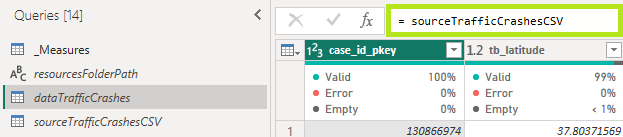
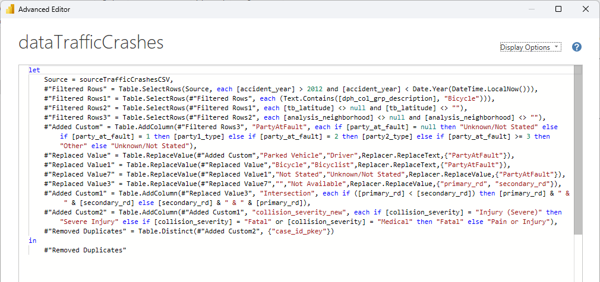

# Bicycle Collisions with Injuries in San Francisco

And interactive dashboard to explore bicycle collisions with injuries in San Francisco from 2013 to 2023, identify trends, and assess if and under what circumstances bicycling has gotten safer.

## Table of Contents

* [Overview](#overview)
* [Setup and Usage](#setup-and-usage)
    * [Software Requirements](#software-requirements)
    * [Setup Instructions](#setup-instructions)
    * [Application Usage](#application-usage)
* [Data](#data)
    * [Sources](#sources)
    * [Aquisition](#acquisition)
    * [Processing](#processing)
    * [Data Model](#data-model)
* [Repository Structure](#repository-structure)
* [Project Evaluation](#project-evaluation)
* [Future Work](#future-work)
* [Acknowledgements](#acknowledgements)
* [License](#license)

## Overview

The purpose of this project was to 1) test and expand my skills using Power Bi, 2) utlize data from DataSF, and 3) explore traffic collisions with injuries involving bicyclists. My interest in bicycle collisions is quite personal as I am an avid cyclist and have been hit by a car once while cycling to work and once when riding for pleasure.

## Setup and Usage

The following software requirements and instructions were developed and have only been tested on a Windows 11 computer.

### Software Requirements
1. Applications: Microsoft Power BI Desktop
2. Python Version: 3.10.13
3. Python Packages: requests, pathlib, pandas, census
4. Editors: VS Code 1.86 and Jupyter Notebook 6.5.4

Note: Items 2-4 are only needed if you will be using the Jupyter notebook to import and clean US census data.

### Setup Instructions
1. Verify the above software requirements and dependencies have been met on your computer.
2. Clone this repository on your local computer. If you do not want to clone the repository, you can download the [bicycle_collisions_sf.pbix](bicycle_collisions_sf.pbix) Power Bi report and the two CSV files in the [resources](resources/) folder. You will still need to follow steps 3-7 below.
3. Open the Power Bi Report.
4. Select **Transform data** from the Home tab to open the Power Query Editor.
5. Select the **resourcesFolderPath** query and replace the folder path with the full path to the [resources](resources/) folder on your computer.

    

6. If you would like to access traffic crashes data directly through data.sfgov.org,
    * Select the **dataTrafficCrashes** query.
    * Click on the **Source** step.
    * Replace **sourceTrafficCrashesCSV** with **sourceTrafficCrashesDataSF**.

        
    
    Note: You may need to review and remove rows with errors when importing data. 
7. Select **Close & Apply** from the Home tab.

#### If you would like import updated or additional census information,
1. Edit the [config_blank.py](data_processing/config_blank.py) file in the data_processing folder. Update the variable with your API key.You can get an API key at https://api.census.gov/data/key_signup.html.
    ```
    census_key = '[Enter your API key without the brackets]'
    ```

2. Save and close the file. Then rename it to config.py.
3. Open a terminal window in the database directory and start Jupyter Notebook.
    ```
    jupyter notebook
    ```
3. From Jupyter notebook, open the file [data_processing_us_census.ipynb](data_processing/data_processing_us_census.ipynb).
4. Modify the code if necessary and run each cell to import the data, create a dataframe and export it to a CSV file.
5. Open the Power Bi report, select **Transform data** from the Home tab and modify the **dimCensusData** query as needed.

### Application Usage

1. Open the [bicycle_collisions_sf.pbix](bicycle_collisions_sf.pbix) Power BI Report. This report contains 5 dashboard pages and 2 ToolTip pages.

3. Use the page tabs at the bottom or 5 icons on the left navigation menu to move between the dashboard pages. Be sure to control-click on the icons.

    

3. Use the 3 slicers along the top to filter data on any of the 5 dashboard pages. You can also filter visuals directly or use the filters panel.

    

[Back to Table of Contents](#table-of-contents)

# Data

## Sources
* **DataSF**: Data on traffic crashes resulting in injury was available at https://data.sfgov.org/Public-Safety/Traffic-Crashes-Resulting-in-Injury/ubvf-ztfx/about_data
* **US Census Bureau**: Data on bike communters in San Francisco was available at https://data.census.gov

## Aquisition
* DataSF: Data was exported to a csv for initial exploration and then imported into Power Bi using an odata connection. The Power Bi report is designed to use both methods.
* US Census Bureau: Data was imported into a pandas dataframe using the <a href="https://pypi.org/project/census/" target="_blank">census python package</a>.

## Processing
The US Census Bureau data was processed using Python in a [Jupyter notebook](data_processing/data_processing_us_census.ipynb) as follows:
1. Population data for each year was imported into a separate dataframe and then merged into one dataframe.

    

2. The data was transformed by isolating and renaming the year, population, and bike commuter columns and correcting the data type for the last two columns. The dataframe was then exported to a CSV file.

    
    

The DataSF dataset was processed using Power Query in Power Bi as follows:
1. The **sourceTrafficCrashesCSV** query was created to import the data from a csv file. Unneeded columns were then removed from the query.

    

2. The **dataTrafficCrashes** query was created directly referencing the above query. The data was then filtered to remove rows with null values and crashes not involving bicycles.

    

3. The **dimCollisionType** query was created referencing the **dataTrafficCrashes** query to get a list of the unique collision types and create a primary key column.

    

4. Similar queries were created for lists of the unique collision severities, neighborhoods, parties involved in the collisions, parties at fault and vehicle code violations.

5. The **factCollisions** query was created referencing the **dataTrafficCrashes** query to merge all of list queries and replace text values with their primary key to optimize the data and minimize the project's storage size.  

    

## Data Model

The following data model was created in Power Bi:

   


[Back to Table of Contents](#table-of-contents)

# Repository Structure

This repository is organized into the following folders:
* [images](images) - image files for Power Bi report and README.
* [data_processing](data_processing) - Jupyter notebook and python files to import and processes US Census data (population and bike commuter information).
* [resources](resources) - data source files and helpful information obtained on various city websites
* [root](/) - Power Bi Project, license file, and this readme.

[Back to Table of Contents](#table-of-contents)

# Project Evaluation

This project was an incredible learning opportunity not only in expanding my Power Bi skills, but in exploring the vast amounts of data publically available through DataSF and understanding the city's Vision Zero initiative. Through reviewing their online reports and dashboards, I now see the product of their work every time I step out my door and bicycle across the city. They are focused on ending traffic deaths by continually increasing the safety of our streets and transportation systems. They are using data to evaluate and inform their projects and making this data available to the public. I also just learned that City Performance Team just completed a benchmarking project to compare San Francisco's efforts on key metrics alongside its peer cities. For more information, visit https://www.sf.gov/data/vision-zero-benchmarking-overview.

[Back to Table of Contents](#table-of-contents)

# Future Work

Some recommended areas of future work on this application include:
* Neighborhood Level Census Data - The collion rate by neighborhood would allow a comparison of bicycle safety between neighborhoods.
* Vision Zero High Injury Network - Overlay high injury network on the map visual and analyze collision rates over time for the identified street sections. Map of network is available at https://sfgov.maps.arcgis.com/apps/webappviewer/index.html?id=b2743a3fc0b14dd9814cf6668fc34773.
* Vision Zero Protected Bike Lanes - Isolate collisions on streets before and after protected lanes were installed.
* Other Vision Zero Projects - Compare collision numbers before and after implementation of other projects including improvements to the High Injury Network, 20 mph corridors, intersections with no turn on red signs, intersections with turn calming, and traffic calming devices. For more information on these projects, visit https://www.sfmta.com/vision-zero-safe-streets-progress. 

[Back to Table of Contents](#table-of-contents)

# Acknowledgements

I foremost want to thank Maia Moran and Jacob Henke from the San Francisco Municipal Transportation Agency. They provided manual counts for 2018 and 2019, as well as automated bike counts from 2018 through 2022. They were in the process of system upgrades and were extremely helpful in the midst of system upgrades. Given the changes in the number and locations of automated bike counters over the years, I decided not to use this data as an indicator of the annual number of cyclists. They have published their data on the MTA website at https://www.sfmta.com/reports/average-weekday-bike-volumes-dashboard. 


I'd also like to acknowledge the following resources:
*  DataSF and the Department of Public Health (DPH)- The "Traffic Crashes Resulting in Injury" dataset provides detailed information regarding traffic collisions in San Francisco and was the primary data source. DPH obtains and analyzes data from the SFPD, and publishes it through DataSF. DataSF provides access to this data through file export, API, oData and querying/visualizing the data using their online tools. Visit https://www.sf.gov/departments/city-administrator/datasf to learn more about available data and their services.
*  US Census Bureau - One of the many available datasets includes bicycle commuting as a means of transportation to work. This was used as an indicator of the annual number of bicyclists in San Francisco to calculate the collision rate and assess changes in the safety of bicycling over the years.
*  Jeremy Carbaug - Jeremy is the author of the Python package, census, which is a simplye wrapper for the United States Census Bureau’s API. This package simplifies the process of importing census data through their API.

[Back to Table of Contents](#table-of-contents)

# License

This project is licensed under the [MIT license](LICENSE.txt).

[Back to Table of Contents](#table-of-contents)